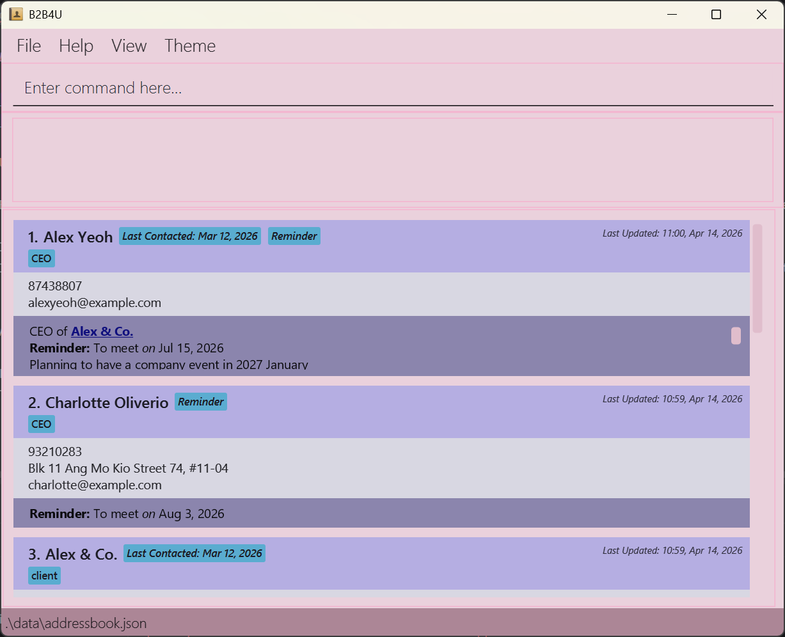

**B2B4U** allows better management of long term relationships with big companies and clients through a simple, unified interface.

**B2B4U** users with quick, up-to-date access to clients’ data and relevant services necessary for quick and on-point responses.

For the detailed documentation of this project, see the **[B2B4U Product Website](https://ay2526s2-cs2103t-t08-1.github.io/tp/)**.

## Acknowledgements
This project is based on the AddressBook-Level3 project created by the [SE-EDU initiative](https://se-education.org).
